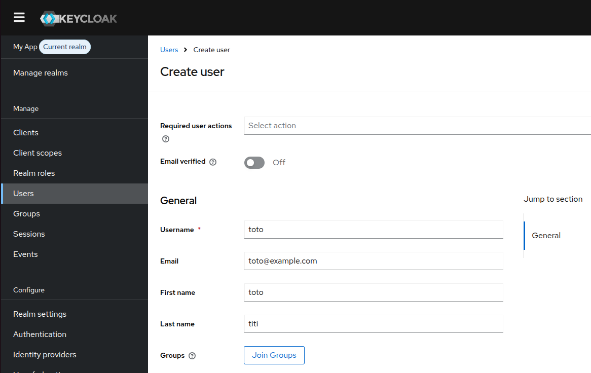
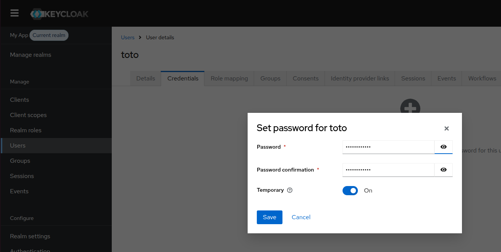
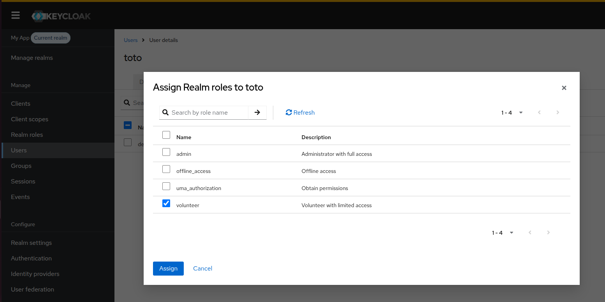
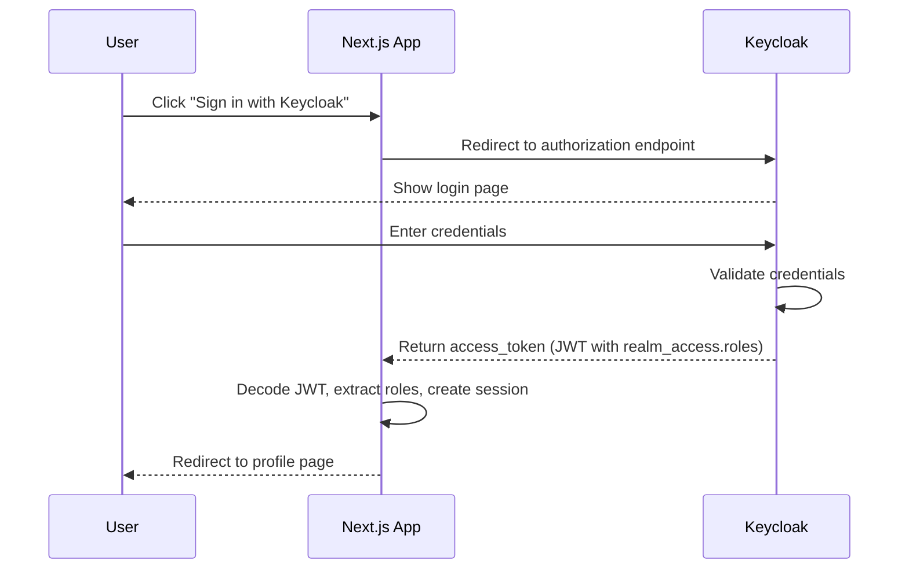

# Setup, User Management & Auth Flow

## Prerequisites

- **Node.js 18** or later
- **Docker** and **Docker Compose**
- **npm** (comes with Node.js)

Verify your installations:

```bash
node --version
docker --version
docker compose version
```

## Getting Started

### 1. Start Keycloak

```bash
docker compose up -d
```

This starts Keycloak on `http://localhost:8080` with a preconfigured realm. Two roles (`admin` and `volunteer`) and three demo users are included.

### 2. Configure Environment

```bash
cp .env.example .env.local
```

Generate an Auth.js secret:

```bash
npx auth secret
```

Paste the output into `AUTH_SECRET` in `.env.local`. The rest of the values already match the preconfigured realm:

```
AUTH_SECRET=<your-generated-secret>
AUTH_URL=http://localhost:3000
AUTH_KEYCLOAK_ID=app-client
AUTH_KEYCLOAK_SECRET=app-client-secret
AUTH_KEYCLOAK_ISSUER=http://localhost:8080/realms/my-app
```

### 3. Install and Run

```bash
npm install
npm run dev
```

Open `http://localhost:3000` and sign in with one of the demo accounts:

| Username   | Password   | Role      |
| ---------- | ---------- | --------- |
| admin      | admin      | admin     |
| volunteer1 | volunteer1 | volunteer |
| volunteer2 | volunteer2 | volunteer |

**What to expect:**

- All users land on the profile page after login
- Users with the `volunteer` role see the **Donations** link in the nav and can view donations
- Users with the `admin` role see both **Admin** and **Donations** links
- A volunteer visiting `/admin` directly sees "Access Denied"

---

## Managing Users in Keycloak

The application does not manage users directly. All user creation, role assignment, password resets, and account management happen in the Keycloak Admin Console. Keycloak is the single source of truth for identity.

### Accessing the Admin Console

1. Open `http://localhost:8080/admin` and log in with:
   - **Username:** `admin`
   - **Password:** `admin`

   > This is the Keycloak admin account, not the application's admin user. In production, use strong credentials.

2. In the top-left corner, switch the realm from **master** to **my-app**. All user and role management must be done inside the correct realm.

### Creating a New User

1. In the left sidebar, click **Users**
2. Click **Add user** (top right)
3. Fill in the fields:
   - **Username** - the login name (e.g., `john`)
   - **Email** - the user's email address
   - **First Name** / **Last Name** - optional but recommended
4. Click **Create**



### Setting a Password

1. Stay on the user's detail page
2. Click the **Credentials** tab
3. Click **Set password**
4. Enter and confirm the password
5. Choose **Temporary** (user must change on first login) or leave unchecked for permanent
6. Click **Save**



### Assigning a Role

Roles determine what the user can access in the application.

1. Stay on the user's detail page
2. Click the **Role Mapping** tab
3. Under **Assign role > Realm roles**, select a role (`admin` or `volunteer`)
4. Click **Add selected**



| Role        | What it grants                                   |
| ----------- | ------------------------------------------------ |
| `admin`     | Access to the Admin Dashboard and Donations page |
| `volunteer` | Access to the Donations page only                |

A user can hold multiple roles. Assigning both `admin` and `volunteer` grants full access.

### Other Operations

| Operation            | How                                                |
| -------------------- | -------------------------------------------------- |
| Reset a password     | Users > select user > Credentials > Reset password |
| Disable an account   | Users > select user > toggle Enabled off           |
| Delete a user        | Users > select user > Actions > Delete             |
| View active sessions | Sessions (left sidebar)                            |

---

## Authentication Flow

When a user clicks "Sign in with Keycloak", the following sequence occurs:



**Key points:**

- The JWT is decoded in the `jwt` callback in `auth.ts`. No extra HTTP calls to Keycloak.
- The raw token contains internal roles like `default-roles-*`, `uma_authorization`, and `offline_access`. These are filtered out before reaching the session. Only application roles (`admin`, `volunteer`) remain.
- The session carries `user.id`, `user.name`, `user.email`, and `user.roles`.

### Authorization is enforced in two layers

**Layer 1: Middleware** (`middleware.ts`)

Runs on every matching request before the page loads. Checks if the user is authenticated and has the correct role for the route. Redirects to `/login` or `/unauthorized` if not.

**Layer 2: Server Components** (e.g., `app/admin/page.tsx`)

Each protected page calls `requireRole()` which reads the session server-side. If the user lacks the required role, an `AuthorizationError` is thrown and the user is redirected. This means even if middleware is somehow bypassed, the page itself denies access.

You are not relying on hiding nav links. You are checking permissions at the server level on every request.
